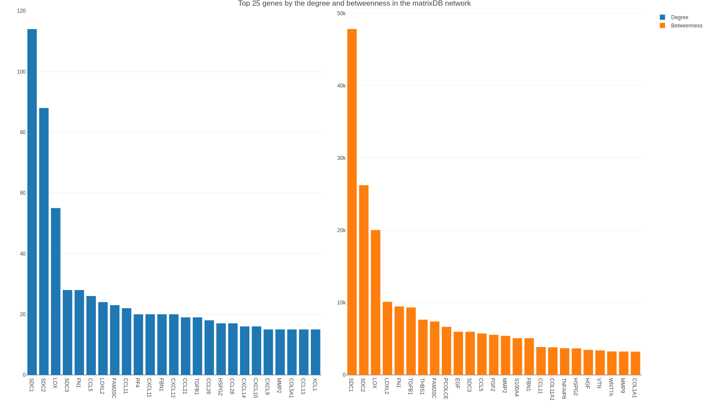
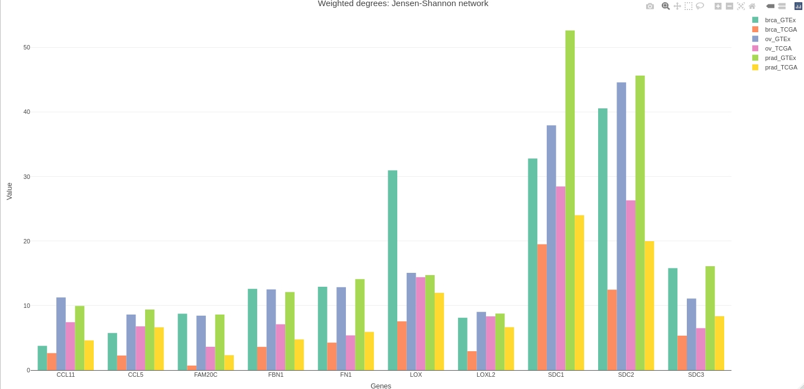
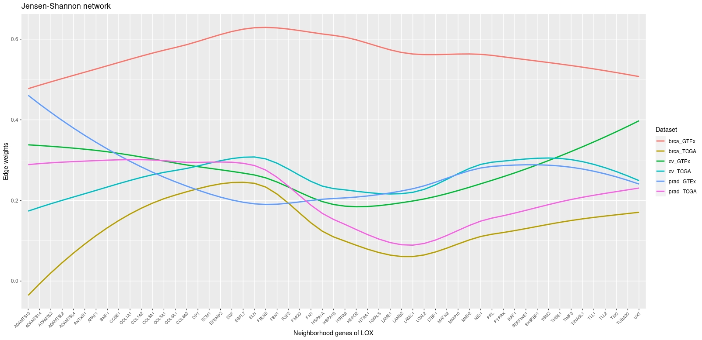

MatriNet is a recently published online database and analysis platform for the exploration of extracellular matrix (ECM) protein networks across tumors with interactive tools embedded into graphical user interfaces (available at www.matrinet.org).  This package is an open-source repository and a modular extension to MatriNet that enables local operations on the same data sources with enhanced customizations, previews features before their online implementation, and promotes collaborative efforts and community-driven solutions for the MatriNet ecosystem.


<!-- GETTING STARTED -->
## Install the package
The developmental version of MatriNet R package is freely available and can be installed as follows:
```r
require(devtools)
devtools::install_github("KontioJuho/matrinetR")
``` 

If you have any questions or suggestions, please feel free to contact us.

<!-- USAGE EXAMPLES -->
## Package structure

The most central object of matrinetR package and the analysis workflow is **matrigraph**. At first, all prior information about the genes/proteins (e.g.family/category)  and their underlying network structure (e.g., the edgelist from matrixDB) are stored into the *initial* matrigraph object. The matrinetR workflow is about updating the initial matrigraph  with properties estimated from the input data. This, in turn, requires gene/protein level input data, which must be given in a specific **matridata** form. The relationships between matrigraph, matridata, and provided functions can be summarized as follows:

| Function | Input | Output |
| --- | --- | --- |
| `matrinet_data` |  List of cancer specific data frames | Matridata: Prepared gene/protein data|
| `matrinet_graph` | Edgelist and Matridata | Matrigraph: Initial structure |
| `matrinet_estimate` | Matridata and Matrigraph | Matrigraph: Updated structure|

## Matrigraph

### Initial matrigraph structure
Matrigraph is the graph object that is created for each group and is consisting of two objects: **node.df** and **edge.df**.  All of the preceding network data, e.g. known interactions and prior weigths, are stored into a edge.df dataframe. By default, this is an edge-list with two colums, Gene1 and Gene2, representing experimentally verified matrisome interactions downloaded from matrixDB. Moreover, any number of gene-specific annotations could be added into a node.df dataframe as a new column. 

<details><summary>Click to see an example</summary>
<p>
  
|Gene1 | Gene2 | Family 1 | Family 2 |
| --- | --- | --- | --- |
| A2M | IL10 | ECM REGULATORS | SECRETED FACTORS|
| A2M | MFAP2 | ECM REGULATORS | ECM GLYCOPROTEINS|
| . . . | . . . | . . . |. . . |
| COCH | COL2A1 | ECM GLYCOPROTEINS | COLLAGENS|
  
  </p>
</details>

### Output matrigraph structure
While matrigraph objects are created before the actual estimation process,  it also serves for storing the results. The main network estimation function, matrinet_estimate, takes matrigraph as an input and updates edge.df object by adding new columnds representing estimated weights for each element in the matrigraph edgelist.
<details><summary>Click to see an example</summary>
<p>

|Gene1 | Gene2 | Family 1 | Family 2 |  Correlation | Mutual information | Jensen-Shannon Divergence | 
| --- | --- | --- |--- | --- | --- | --- |
| A2M | IL10 |ECM REGULATORS | SECRETED FACTORS | 0.03 | 0.4 | 0.11|
| A2M | MFAP2 | ECM REGULATORS | ECM GLYCOPROTEINS | 0.21 | 0.04 | 0.45|
| . . . | . . . | . . . |. . . | . . . | . . .| . . . |
| COCH | COL2A1 |ECM GLYCOPROTEINS | COLLAGENS | 0.25 | 0.17 | 0.16|
  
  </p>
</details>

## Matridata 
MatrinetR extends the original protein-level network analysis of MatriNet into a gene-level and provides pre-processed gene expression and clinical data for 23 tumor types from The Cancer Genome Atlas (TCGA) and corresponding normal (GTEx) tissues from the Genotype-Tissue Expression (GTEx) database. Since this provides an indidividual level expression data, a wide variety of different network estimation method can be applied. With gene-level data, matridata object is consisting of three separate dataframes of preprocessed mRNA data, that are used in different ways in the network estimation process: 


**Continuous:** For each sample group of interest, datasets of *continuous* type are consisting of the original input data given at continuous scale.log2-transformed gene/protein expression data with n (sample size) rows and p (number of genes) columns. For example, by using the built-in *matrisome_TCGA* dataset, the above values represent the batch effect normalized and log2(norm_value+1) transformed expression levels, downloaded from UCSC Xenahub platform's PanCancer Atlas https://xenabrowser.net/datapages/.


 
**Discrete:** Datasets of *discrete* type are the discretized gene/protein expression-level version of *continuous* datasets with n rows and p columns with values -1, 0, and 1. Discretization levels can be defined by users (see tutorial).  


  **Profile:** Frequency distributions of discretized gene/protein expression levels with 3 rows (low, medium, high) and p columns.

<details><summary>Continuous data example (click)</summary>
<p>

| sampleID | ADAMTSL5 | ADIPOQ | AGRN | AMBP | AMELX | ANGPTL4 | AREG | BDNF | BGN | BMP1 | BMP2 |
| --- | --- | --- | --- | --- | --- | --- | --- | --- | --- | --- | --- |
| brca_0001 | 3.32 | 5.2 | 12.93 | 2.54 | 0 | 5.2 | 9.49 | 1.69 | 13.36 | 9.19 | 2.78|
| brca_0002 | 5.54 | 6.91 | 11.45 | 2.69 | 0 | 9.91 | 6.95 | 4.85 | 13.91 | 9.9 | 3.92|
| brca_0003 | 6.32 | 10.83 | 13.19 | 4.51 | 0 | 10.55 | 12.45 | 2.73 | 14.9 | 10.69 | 4.04|
| . . .  | . . .  | . . .  | . . . | . . .  | . . .  | . . .  | . . .  | . . . | . . .  | . . .  | . . . |
| brca_0931 | 5.23 | 6.75 | 13.31 | 4.21 | 0 | 7.06 | 10.48 | 3.61 | 14.42 | 10.66 | 4.3|
| brca_0932 | 5.18 | 4.78 | 13.33 | 4.43 | 0 | 5.8 | 8.24 | 6.47 | 14.79 | 10.31 | 4.87|

  </p>
</details>


<details><summary>Discretized data example (click)</summary>
<p>


 | sampleID |ADAMTSL5 | ADIPOQ | AGRN | AMBP | AMELX | ANGPTL4 | AREG | BDNF | BGN | BMP1 | BMP2 |
| --- | --- | --- | --- | --- | --- | --- | --- | --- | --- | --- | --- |
| brca_0001 | -1 | 0 | 1 | -1 | -1 | 0 | 0 | -1 | 1 | 0 | -1|
| brca_0002 | 0 | 0 | 1 | -1 | -1 | 0 | 0 | 0 | 1 | 0 | 0|
| brca_0003 | 0 | 1 | 1 | 0 | -1 | 1 | 1 | -1 | 1 | 1 | 0|
| . . .  | . . .  | . . .  | . . . | . . .  | . . .  | . . .  | . . .  | . . . | . . .  | . . .  | . . . |
| brca_0931 | 0 | 0 | 1 | 0 | -1 | 0 | 1 | 0 | 1 | 1 | 0|
| brca_0932 | 0 | 0 | 1 | 0 | -1 | 0 | 0 | 0 | 1 | 1 | 0|
    </p>
</details>


<details><summary>Profile data example (click)</summary>
<p>
  
|Level |ADAMTSL5 | ADIPOQ | AGRN | AMBP | AMELX | ANGPTL4 | AREG | BDNF | BGN | BMP1 | BMP2 |
| --- | --- | --- | --- | --- | --- | --- | --- | --- | --- | --- |--- |
| Low | 0.1226 | 0.2206 | 0 | 0.5712 | 0.9975 | 0.0222 | 0.07 | 0.6815 | 0 | 0 | 0.1679|
| Medium | 0.8774 | 0.5062 | 0.0272 | 0.4247 | 0.0025 | 0.8568 | 0.7523 | 0.3177 | 0.0091 | 0.7407 | 0.8288|
| High | 0 | 0.2733 | 0.9728 | 0.0041 | 0 | 0.121 | 0.1778 | 0.0008 | 0.9909 | 0.2593 | 0.0033|
  
</p>
</details>

## Network estimation

The matrinet_estimate, takes matrigraph and matridata as an input and estimates network weights of different type for each element in the matrigraph edgelist. The default network weigts (that can be customized) are estimated from different data types as follows:

| Datatype | Default metric | matrisome_THPA | matrisome_TCGA |matrisome_GTEx |
  | --- | --- | --- | --- | --- |
  |  Continuous data | Correlation| Not available |Available |Available|
  | Discrete data | Mutual information|Not available |Available|Available|
  | Profile data | Jensen-Shannon Divergence |Available |Available|Available|


<details><summary>Click to see an output example</summary>
<p>

|Gene1 | Gene2 | Family 1 | Family 2 |  Correlation | Mutual information | Jensen-Shannon Divergence | 
| --- | --- | --- |--- | --- | --- | --- |
| A2M | IL10 |ECM REGULATORS | SECRETED FACTORS | 0.03 | 0.4 | 0.11|
| A2M | MFAP2 | ECM REGULATORS | ECM GLYCOPROTEINS | 0.21 | 0.04 | 0.45|
| . . . | . . . | . . . |. . . | . . . | . . .| . . . |
| COCH | COL2A1 |ECM GLYCOPROTEINS | COLLAGENS | 0.25 | 0.17 | 0.16|
  
  </p>
</details>

The weights are then added as new columns to the inital matrigraph edgelist (as shown above). This allows for a more thorough study of gene-gene interactions because all of them represent distinct types of pairwise dynamic between genes. Note that only Jensen-Shannon metric is available for the THPA data since only expression profile data is available.

## Tutorial

### Step 1: Check gene availability and validity
The matrinetR workflow begins by specifying the target genes of interest to check if they are accessible in the gene/protein data set. Furthermore, the input datasets are considered to be valid for the network estimation process only with complete observations, i.e.,  without any missing values.  Both gene availability and validity can be checked automatically with the provided "available_genes"  functions with two arguments: a character vector of target genes and the input data. 

```r
library(matrinetR)

#Check which cancers have samples from both cohorts:
intersect(names(matrisome_TCGA), names(matrisome_GTEx))

#In this example, we will use a small subset of cancers:
cancers <- c("brca", "ov", "prad")


#Check which genes are available without NA values

matrisome_genes <- unique(c(matrixDB_edgelist$Gene1, matrixDB_edgelist$Gene2))

valid_genesTCGA <- available_genes(target_genes = matrisome_genes,
                                   data = matrisome_TCGA[cancers])

valid_genesGTEx <- available_genes(target_genes = matrisome_genes,
                                   data = matrisome_GTEx[cancers])

#Select the genes that are available and valid in both cohorts 
valid_genes <- intersect(valid_genesTCGA$available_zero_NAs,
                         valid_genesGTEx$available_zero_NAs)

```
It returns 1) available genenames, 2) missing genenames, 3) available genes without missing values, and 4) available genes with  less than 5% of missing values over samples in any group. Note that the option IV requires an additional missing-value imputation method to be employed.

### Step 2: Create the input matridata 
Matrinet estimation process evaluates dependency structures using different expression data forms (see above): To discretize expression levels, users have to provide thresholds for different levels. In example, the code below recodes gene-expression levels as -1, 0, and 1 (or low, medium, high) using thresholds corresponding to the expression levels of 10 TPMs and 1000 TPMs.

```r

discretization_levels <- c(log2(10+1), log2(1000+1))

matridata_GTEx <- matrinet_data(data = matrisome_GTEx[cancers],
                                quantiles = discretization_levels,
                                genenames = valid_genes)


matridata_TCGA <- matrinet_data(data = matrisome_TCGA[cancers],
                                quantiles = discretization_levels,
                                genenames = valid_genes)

```

### Step 3: Initialize the matrigraph structure

The next step is to create initial matrigraph objects from the matrixDB data for all selected cancer groups in both cohorts:

```r

matrigraph_TCGA <- matrinet_graph(matridata = matridata_TCGA,
                                  prior_topology = matrixDB_adjacency[valid_genes,valid_genes])

matrigraph_GTEx <- matrinet_graph(matridata = matridata_GTEx ,
                                  prior_topology = matrixDB_adjacency[valid_genes,valid_genes])

```

The form of matrigraph objects is made compatible with a variety of existing package, such as igraph, qgraph, and visnetwork, that may be utilized before and after updating the matrigraph. See the examples below:  


<details><summary>Example 1: How to build an interactive network representation? </summary>
<p>
  
  Representing the entire network becomes difficult with static figures when the number of nodes is large. 
  One posssible solution is to create an interactive graph with the possibility of zooming in and out. The code below shows how to create such a graph with the visNetwork package:
  
  ```r
  
  #Create an igraph object from the edgelist
      g <- graph_from_data_frame(d = matrixDB)
           
  #Convert it to visnetwork object
      visnet <- toVisNetworkData(g)

  #Visualization steps
      visNetwork(visnet$nodes, visnet$edges) %>%
         visIgraphLayout(randomSeed = 123) %>%
         visNodes(size = 10) %>%
       visOptions(highlightNearest = list(enabled = T, hover = T), nodesIdSelection = T)

  ```
  
  </p>
</details>

<details><summary>Example 2: How to identify the genes with the hignest network degree and betweenness values? </summary>
<p>
  
  

  
```r
  
matrixDB_summary <- centrality_auto(matrixDB_adjacency[valid_genes,valid_genes])
node.df.update <- matrixDB_summary$node.centrality[,c("Degree", "Betweenness")]


top25_degree_genes <- node.df.update[order(node.df.update[,"Degree"], decreasing = T)[1:25], ]

library(plotly)

fig <- plot_ly(
  data = top25_degree_genes,
  x = rownames(top25_degree_genes),
  y  = ~Degree,
  name = "Degree",
  type = "bar"
) %>% 

layout(xaxis = list(categoryorder = "total descending"))


top25_betweenness_genes <- node.df.update[order(node.df.update[,"Betweenness"], decreasing = T)[1:25], ]


fig2 <- plot_ly(
  data = top25_betweenness_genes,
  x = rownames(top25_betweenness_genes),
  y  = ~Betweenness,
  name = "Betweenness",
  type = "bar"
) %>% 
  
  layout(xaxis = list(categoryorder = "total descending"))


subplot(fig, fig2) %>% 
  layout(title = list(text = "Top 25 genes by the degree and betweenness in the matrixDB network"))


```

  </p>
</details>


### Step 4: Estimate the networks and update matrigraph objects


The network estimation can be done simply from the above matridata and matrigraph objects with the matrinet_estimate function as follows:

```r

matrinet_TCGA <- matrinet_estimate(matrigraph = matrigraph_TCGA,
                                   matridata = matridata_TCGA)

matrinet_GTEx <- matrinet_estimate(matrigraph = matrigraph_GTEx,
                                   matridata = matridata_GTEx)

```

## Network analysis and visualisation

Given the estimated network structures, users could apply a wide range of existing package, such as igraph, qgraph, and visnetwork, to create visual representations of estimated structures in global network scale (see examples below). 

```r

library(igraph)
library(qgraph)
library(visNetwork)

g <- graph_from_data_frame(d = matrinet_TCGA$brca$edge_df,
                           vertices = matrinet_TCGA$brca$node_df)

visnet <- toVisNetworkData(g)

visnet$edges$value <- visnet$edges$JensenShannon_P

visNetwork(visnet$nodes, visnet$edges) %>%
  visIgraphLayout(randomSeed = 123) %>%
  visNodes(size = 10) %>%
  visOptions(highlightNearest = list(enabled = T, hover = T), 
             nodesIdSelection = T) %>% 
  visInteraction(navigationButtons = T) 


#Convert the output matrigraph objects to weighted adjacency matrices
weighted_adjmat <- matrigraph_to_adjacency(output_matrigraph = matrinet_TCGA)
  qgraph::qgraph(weighted_adjmat$prad, edge.color = "dodgerblue4", curve = -0.2, curveAll = TRUE)
  
  ```

### Matrigraph summary object
```r
  

library(netdiffuseR)
library(plotly)

names(matrinet_TCGA) <- paste(names(matrinet_TCGA), "_TCGA", sep = "")
names(matrinet_GTEx) <- paste(names(matrinet_GTEx), "_GTEx", sep = "")


matrigraphs_TCGA_GTEx <- c(matrinet_TCGA,matrinet_GTEx)


summary_cor_net <-  matrigraph_summary(matrigraphs_TCGA_GTEx, metric = "cor_C")
summary_MI_net  <-  matrigraph_summary(matrigraphs_TCGA_GTEx, metric = "MI_D")
summary_JS_net  <-  matrigraph_summary(matrigraphs_TCGA_GTEx, metric = "JensenShannon_P")
summary_sum_net <-  matrigraph_summary(matrigraphs_TCGA_GTEx, metric = "sum_D")


```

### Structural network analysis 


The summary data from the previous section enables to analyse and compare structural properties of estimated networks. One could, for example, first identify genes with the highest expected influences in the baseline matrixDB network structure, and see how the corresponding degrees are varying across cancers. 

```r

node_statistics <- "ExpectedInfluence"
center_genename  <- "LOX"


matrixDB_summary <- centrality_auto(matrixDB_adjacency[valid_genes,valid_genes])
node.df.update <- matrixDB_summary$node.centrality

top10_degree_genes <- node.df.update[order(node.df.update[,node_statistics], decreasing = T)[1:10], ]


```
The matrinetR package provides plotly and ggplot (see output argument) based interactive visualization function *compare_nodestat*, which can be applied on any node-statistics ( "Betweenness", "Closeness", "Strength", "ExpectedInfluence") in the summary object. For example, functions below (one for each network estimation metric) compares the weighted degrees of the top-10-degree genes across all sample groups.    



```r

t1 <- compare_nodestats(summary_MI_net,
                        genes = rownames(top10_degree_genes),
                        nodestat_type = node_statistics,
                        output = "plotly")

#The example figure above
t2 <- compare_nodestats(summary_JS_net,
                        genes = rownames(top10_degree_genes),
                        nodestat_type = node_statistics,
                        output = "plotly")

t3 <- compare_nodestats(summary_cor_net,
                        genes = rownames(top10_degree_genes),
                        nodestat_type = node_statistics,
                        output = "plotly")

t4 <- compare_nodestats(summary_SUM_net,
                        genes = rownames(top10_degree_genes),
                        nodestat_type = node_statistics,
                        output = "plotly")

#The entire layout can be customized with the plotly package.
#For example, titles can be changed as follows:

tt_MI <- t1 %>%  layout(yaxis = list(title = "MUTUAL-INFORMATION NETWORK", zeroline = F))  
tt_JS <- t2 %>%  layout(yaxis = list(title = "JENSEN-SHANNON NETWORK", zeroline = F)) 
tt_cor <- t3 %>%  layout(yaxis = list(title = "CORRELATION NETWORK", zeroline = F))
tt_SUM <- t4 %>%  layout(yaxis = list(title = "PAIRWISE-SUM NETWORK", zeroline = F)) 


```
By observing large differencies, e.g.,  among LOX degrees between BRCA-GTEx and other groups, one 
could analyse all of its interactions at once in more detail with the **neighborhood_plot** function:

<details><summary>Click to see a reproducible code (ggplot2): </summary>
<p>

```r

p1 <- neighborhood_plot(matrigraphs_TCGA_GTEx,
                        prior_topology = matrixDB_adjacency[valid_genes,valid_genes],
                        center_gene = center_genename,
                        weights = "cor_C",
                        smoothness = 1/5)

p1 <- p1 + ggtitle("Correlation network") +
           theme_neighborhood +
           scale_color_brewer(palette = "Paired", direction = 1)


p2 <- neighborhood_plot(matrigraphs_TCGA_GTEx,
                        prior_topology = matrixDB_adjacency[valid_genes,valid_genes],
                        center_gene = center_genename,
                        weights = "MI_D",
                        smoothness = 1/5)

p2 <- p2 + ggtitle("Mutual information network") +
           theme_neighborhood +
           scale_color_brewer(palette = "Paired", direction = 1)

#The example figure above
#From expression profiles
p3 <- neighborhood_plot(matrigraphs_TCGA_GTEx,
                        prior_topology = matrixDB_adjacency[valid_genes,valid_genes],
                        center_gene = center_genename,
                        weights = "JensenShannon_P",
                        smoothness = 1/5)

p3 <- p3 + ggtitle("Jensen-Shannon network")+
           theme_neighborhood +
           scale_color_brewer(palette = "Paired", direction = 1)


p4 <- neighborhood_plot(matrigraphs_TCGA_GTEx,
                        prior_topology = matrixDB_adjacency[valid_genes,valid_genes],
                        center_gene = center_genename,
                        weights = "sum_D",
                        smoothness = 1/5)

p4 <- p4 + ggtitle("Pairwise-sum network")+
           theme_neighborhood +
           scale_color_brewer(palette = "Paired", direction = 1)


plotgrid <- ggarrange(p1,p2,p4,p3, ncol = 1,
                      legend = "top", common.legend = TRUE)


h2 <- annotate_figure(plotgrid,
                top = text_grob("LOX neighborhood comparison", color = "black", face = "bold", size = 12),
                bottom = text_grob("Data source:", color = "white",
                                   hjust = 1, x = 1, face = "italic", size = 10),
                fig.lab = "B", fig.lab.face = "bold",
                fig.lab.size = 12
)

h2

```
</details>
  </p>


The above function can be applied to any other gene as well by changing the "center_gene" argument. In the resulting plot, all genes connected with the chosen center gene (connected in the matrixDB graph structure) are shown in the x-axis. Then each group-specific line represents pairwise associations (edge-weigts) between the center gene and the genes in the x-axis. This is the function used in the online MatriNet LX version.


_For more examples, please refer to the [Documentation]()_

<p align="right">(<a href="#top">back to top</a>)</p>
